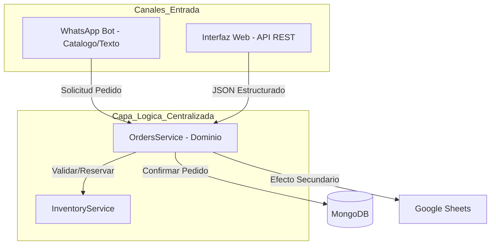

# Flujo Unificado de Pedidos: WhatsApp, Web y Automatización

Este documento describe cómo el sistema AGENTES gestiona la entrada de pedidos desde diferentes canales (WhatsApp, Interfaz Web) y cómo centraliza la lógica de negocio para asegurar coherencia en la persistencia (MongoDB) y reportes (Google Sheets).

## 1. Arquitectura de Convergencia
La clave de este sistema es la centralización. Independientemente del canal de origen, **toda la lógica de procesamiento de pedidos ocurre en `OrdersService`**.

## 2. Captura de Pedidos por Canal

### A. WhatsApp (Catálogo / Texto)
*   **Origen:** El cliente interactúa a través de WhatsApp.
*   **Captura:** El `SalesAgent` (orquestador de conversación) interpreta la intención del usuario.
*   **Estructuración:** El agente extrae los productos y cantidades.
*   **Integración:** Llama a `OrdersService.createOrder()` pasando los datos normalizados.
*   **Propósito:** Permite flexibilidad conversacional manteniendo reglas de negocio estrictas.

### B. Interfaz Web (API REST)
*   **Origen:** Panel de control del cliente o administrador.
*   **Captura:** El `WebOrdersController` recibe un `POST /api/orders` con un DTO (`CreateOrderDto`) que garantiza la estructura del pedido.
*   **Integración:** Llama directamente a `OrdersService.createOrder()`.
*   **Propósito:** Alta velocidad, datos estructurados y validación instantánea.

## 3. El Rol de `OrdersService` (La Fuente de Verdad)
El `OrdersService` es el único encargado de:
1.  **Validar Cliente:** Verifica que el cliente exista en la base de datos.
2.  **Configuración:** Obtiene costos dinámicos (ej. `COSTO_DOMICILIO`) desde el proveedor de inventario (Google Sheets).
3.  **Instanciación:** Crea la entidad `Order` del dominio.
4.  **Persistencia:** Registra el pedido en MongoDB y dispara las notificaciones a Sheets (efectos secundarios).

## 4. Guía para Agregar Nuevos Canales
Para agregar un nuevo canal (ej. Telegram, Bot de voz futuro), el protocolo es:
1.  Crear el adaptador o controlador correspondiente.
2.  Normalizar los datos de entrada al formato `CreateOrderData` (definido en `OrdersService`).
3.  Invocar `OrdersService.createOrder()`.

---
*Este flujo garantiza que cualquier cambio en las reglas de empaque, cálculo de precios o inventario se realice en un solo lugar (`OrdersService`), impactando a todos los canales simultáneamente.*
