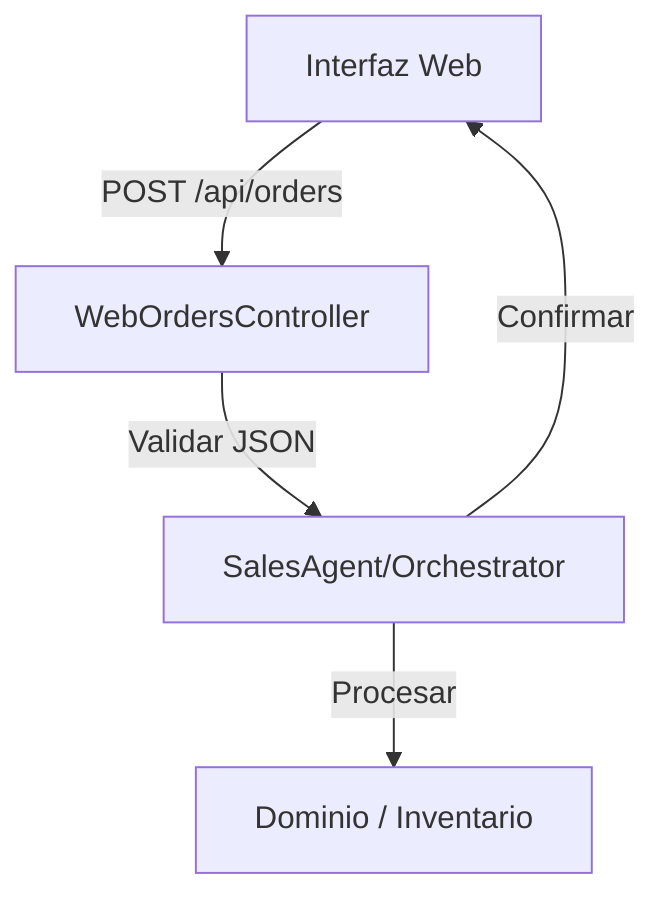

# Flujo de Pedidos: WhatsApp & Arquitectura de Integración

Este documento explica cómo funciona la recepción de pedidos vía WhatsApp y cómo se estructura la integración hacia la nueva interfaz web en la arquitectura A2A (Agencia de Agentes).

## 1. Funcionamiento Actual de WhatsApp

La conexión con WhatsApp se gestiona en `ChannelsService` (`apps/gateway/src/modules/channels/channels.service.ts`) mediante un `WhatsAppAdapter` (de `@agentes/infrastructure`).

### Ciclo de vida del mensaje:
1.  **Recepción:** El `WhatsAppAdapter` recibe el mensaje y ejecuta un callback `handleIncomingMessage` definido en `ChannelsService`.
2.  **Orquestación:** `ChannelsService` delega casi toda la lógica al `OrchestratorService` (`apps/gateway/src/modules/orchestrator/orchestrator.service.ts`).
3.  **Procesamiento Inteligente:** El `OrchestratorService` utiliza al `KnowledgeAgent` para determinar la intención del usuario.
4.  **Ejecución:**
    *   Si es un pedido, se delega al `SalesAgent`.
    *   El `SalesAgent` interactúa con el `InventoryAgent` (para stock) y prepara el pedido.
5.  **Respuesta:** El orquestador invoca un callback de respuesta que `ChannelsService` traduce a una llamada al `WhatsAppAdapter.send()`.

---

## 2. ¿Por qué no se "ve" la nueva forma de agregar pedidos?

Actualmente, el flujo de pedidos está fuertemente acoplado a la interpretación de lenguaje natural por parte de los agentes (SalesAgent + InventoryAgent).

*   **Punto ciego:** Si la nueva "forma de agregar pedidos" consiste en un formulario web o una API REST, el `ChannelsService` no sabe de su existencia porque solo está escuchando a `WhatsAppAdapter` y `TelegramAdapter`.
*   **Ausencia de Gateway Web:** No hay un controlador HTTP (REST) en NestJS que reciba pedidos desde una interfaz web y los inyecte en el `OrchestratorService`.

---

## 3. Estrategia de Conexión: Interfaz Web

Para conectar la nueva interfaz web, debemos crear un puente entre el protocolo HTTP y la lógica de la Agencia de Agentes.

### Propuesta de Arquitectura:

1.  **Crear WebOrdersController (`apps/gateway/src/modules/orders/web-orders.controller.ts`):**
    *   Este endpoint recibirá los datos estructurados (JSON) desde la interfaz web.
    *   Validará los datos usando `class-validator`.

2.  **Inyectar `OrchestratorService` o `SalesAgent`:**
    *   El controlador llamará directamente al servicio encargado de procesar el pedido, saltándose la parte de "interpretación de lenguaje natural" (Intention Analysis), ya que los datos vienen estructurados.

3.  **Transformación a `Message` (Día de Transición):**
    *   Podemos transformar el pedido web a un objeto `Message` con `channel: 'web'` para que el orquestador lo procese como si viniera de un agente, garantizando consistencia en la lógica de negocio.

### Flujo Propuesto:

## Próximos Pasos (Accionables)
1.  Definir la estructura JSON del pedido web.
2.  Implementar `WebOrdersController` en NestJS para recibir POST requests.
3.  Asegurar que `SalesAgent` pueda procesar pedidos estructurados sin necesidad de que pasen por el `KnowledgeAgent`.
